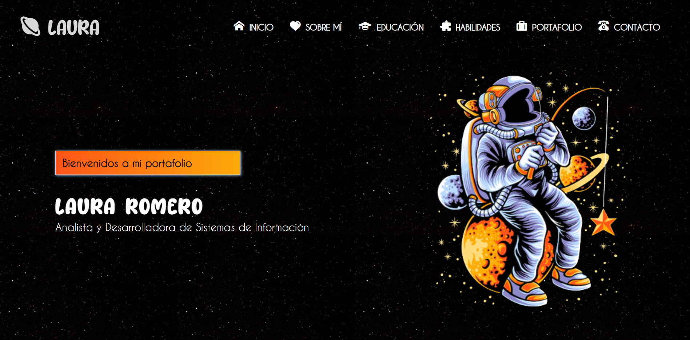

<h1 align="center"> Portafolio </h1>
<h4 align="center"> Sitio Web de Laura Romero 👩🏻‍💻 </h4>

 

## Construido con 🛠️

_Herramientas Utilizadas_

* [Node js](https://nodejs.org/es)
* [Html](https://developer.mozilla.org/es/docs/Web/HTML)
* [Css](https://developer.mozilla.org/es/docs/Web/CSS)
* [JavaScript](https://developer.mozilla.org/es/docs/Web/JavaScript)

## Autores ✒️

* **Laura Romero** - Diseñadora FrontEnd y Analista de Bases de Datos - [LauraRomero](https://github.com/LauraRomero2704)
